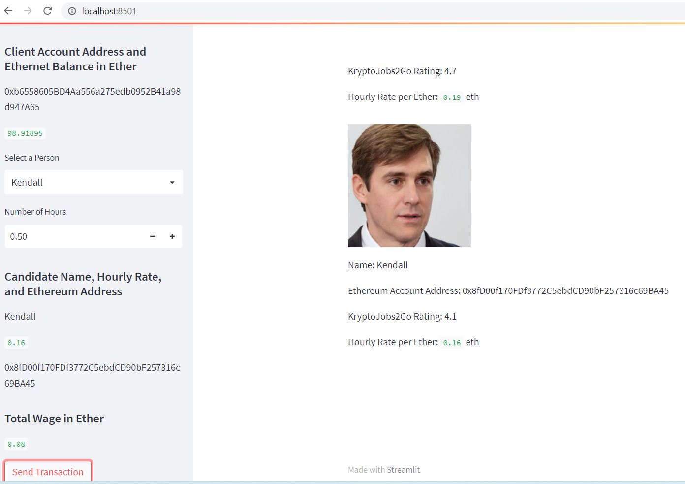
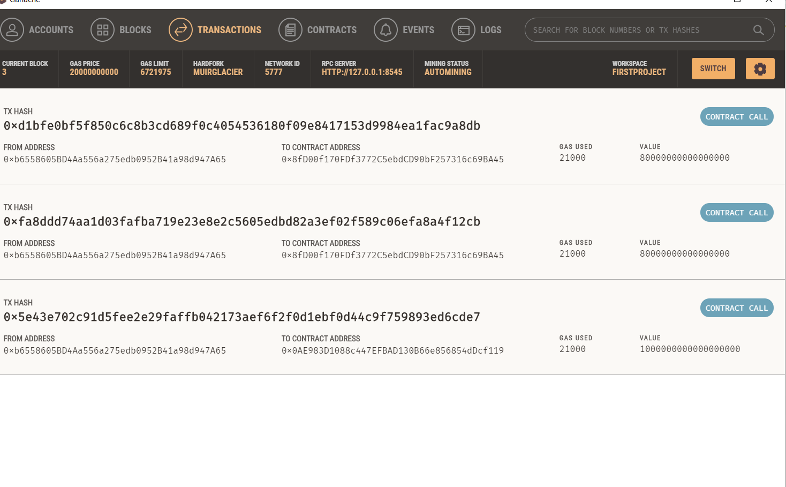
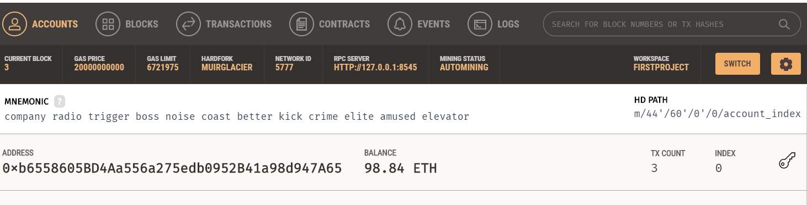

# Ether_Wallet_Transaction

We hired Kendall for only 30min because we are cheap with our ether here:

 
Here is a record of the transactions in Ganache:

 

Here is our account, which unloaded very little ether (because we are cheap):

